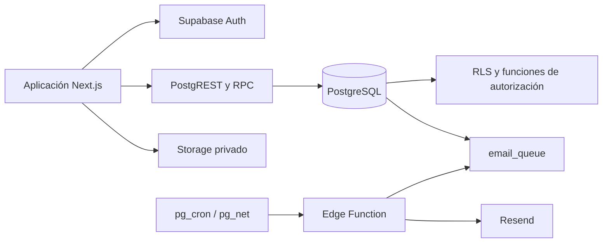
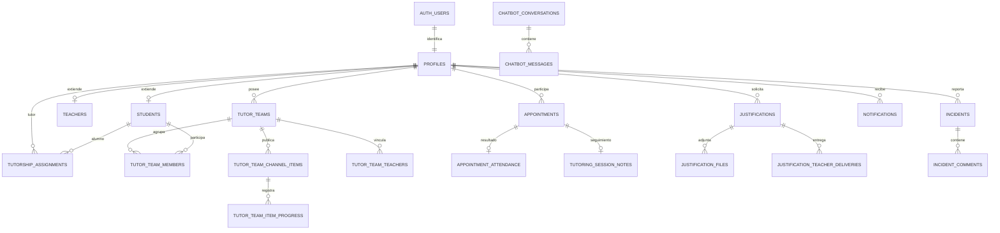

# SyncUT — Documentación formal y técnica de la base de datos

**Sistema:** SyncUT  
**Versión documental:** 1.0  
**Fecha de revisión:** 10 de agosto de 2026  
**Motor y plataforma:** PostgreSQL administrado por Supabase  
**Fuentes revisadas:** 54 migraciones SQL, tipos TypeScript, configuración de Supabase, función Edge de correo y consumo desde la aplicación web.

---

## 1. Propósito, alcance y criterio de revisión

Este documento describe la base de datos de SyncUT de principio a fin: arquitectura, evolución, modelo de datos, relaciones, restricciones, índices, seguridad por fila (RLS), funciones RPC, disparadores, almacenamiento de evidencias, notificaciones, auditoría y operación.

La revisión es **estática y reproducible sobre el repositorio**. El estado esperado se reconstruyó aplicando conceptualmente las migraciones en orden cronológico. No constituye un volcado ni una inspección directa de la instancia productiva; antes de una liberación debe compararse contra el catálogo real de PostgreSQL.

## 2. Resumen ejecutivo

SyncUT usa Supabase como capa de datos y servicios: PostgreSQL almacena la información transaccional, Supabase Auth identifica usuarios, Row Level Security limita cada registro según el usuario, Storage conserva evidencias privadas y una Edge Function procesa correo mediante Resend. La aplicación web consume las tablas directamente y utiliza RPC con `SECURITY DEFINER` para operaciones que requieren validación y atomicidad.

El modelo esperado contiene **35 tablas de aplicación**, además de las tablas administradas por Supabase en los esquemas `auth` y `storage`. Las áreas cubiertas son identidad y gobierno, estructura académica, equipos tutoriales, citas, asistencias, justificaciones, incidencias, notificaciones y chatbot.

La arquitectura es sólida en separación funcional y defensa por RLS. Sus controles más importantes son la protección contra autoasignación de roles, la inmutabilidad de la auditoría administrativa, la protección del último administrador activo, la máquina de estados de justificaciones, el control de traslapes de citas y el acceso privado a evidencias.

El hallazgo prioritario es la **desincronización de `packages/types/src/database.types.ts`**. El archivo no representa cuatro tablas recientes (`tutor_team_channel_items`, `tutor_team_item_progress`, `tutor_team_teachers` y `justification_teacher_deliveries`), columnas recientes de incidencias ni varias RPC. Esto explica conversiones de tipo inseguras en la aplicación y debe corregirse regenerando tipos desde la misma instancia/migración usada en producción.

## 3. Arquitectura lógica



Principios aplicados:

- Identidad canónica en `auth.users`; perfil funcional en `public.profiles` con el mismo UUID.
- Acceso de cliente sujeto a RLS; las credenciales `service_role` se reservan para procesos de servidor.
- Operaciones sensibles encapsuladas en RPC que validan identidad, rol, pertenencia y estado.
- Archivos fuera de PostgreSQL; la base conserva metadatos y rutas.
- Historial especializado para citas, justificaciones e incidencias, más auditoría administrativa transversal.

## 4. Evolución del esquema

Las 54 migraciones se agrupan en estas etapas:

| Etapa | Migraciones principales | Resultado |
|---|---|---|
| Núcleo | 2024-05 a 2026-05 | Perfiles, permisos, auditoría, sesiones y sincronización con Auth. |
| Plataforma académica | 2026-06-05 | Estudiantes, docentes, asignaciones, asistencia, justificaciones, notificaciones, correo y Storage. |
| Incidencias y endurecimiento | 2026-06-15 a 2026-06-18 | Incidencias, helpers de rol, restricciones de RPC y privacidad de perfiles. |
| Módulos operativos | 2026-06-28 a 2026-06-30 | Citas, chatbot, auditorías de dominio, SLA, emisor de notificaciones y asistencia a citas. |
| Integración y datos iniciales | 2026-07-06 a 2026-07-08 | Datos demostrativos, FAQ, procesamiento de correo, equipo tutorial y correcciones productivas. |
| Consolidación | 2026-07-12 a 2026-07-13 | Fusión de coordinador con tutor, gobierno administrativo, espacio de equipo, entregas a docentes, RLS recursiva corregida, incidencias por equipo y disponibilidad de tutor. |

La base debe desplegarse exclusivamente en el orden de nombres de migración. No se recomienda ejecutar archivos aislados ni editar migraciones ya aplicadas.

## 5. Catálogo de tipos enumerados

| Tipo | Valores válidos | Uso |
|---|---|---|
| `attendance_status` | `present`, `tardy`, `absent` | Asistencia académica. |
| `justification_status` | `pending`, `approved`, `rejected`, `requires_more_info` | Flujo de justificación. |
| `justification_category` | `medical`, `official`, `personal` | Clasificación de justificación. |
| `email_status` | `pending`, `processing`, `sent`, `failed`, `cancelled` | Cola de correo. |
| `appointment_status` | `pendiente`, `confirmada`, `cancelada`, `completada`, `no_asistio` | Ciclo de cita. |
| `appointment_modality` | `presencial`, `virtual` | Modalidad de cita/disponibilidad. |
| `appointment_attendance_status` | `attended`, `no_show`, `excused_absence` | Resultado de asistencia a cita. |
| `incident_priority` | `alta`, `media`, `baja` | Prioridad y cálculo del SLA. |
| `incident_status` | `abierta`, `en_proceso`, `resuelta`, `cerrada` | Ciclo de incidencia. |

Otros estados se implementan como texto con `CHECK`: roles, estado de cuenta, estudiantes, asignaciones, miembros de equipo, canales, entregas y chatbot.

## 6. Diccionario de datos

### 6.1 Identidad, acceso y gobierno

#### `profiles`

Extensión uno a uno de `auth.users`. PK `id`; contiene `email`, `full_name`, `phone`, `avatar_url`, `role`, `account_status`, motivo y actor/fecha del cambio de estado, y marcas de tiempo. Roles finales: `student`, `teacher`, `tutor`, `admin`. Estados de cuenta: `active`, `suspended`, `deactivated`. `status_changed_by` referencia a `profiles`. El alta se sincroniza mediante el trigger `on_auth_user_created`; la metadata del usuario no puede conferir un rol privilegiado.

#### `role_permissions`

Catálogo de permisos por rol: `role`, `permission`, descripción y fecha. Es soporte declarativo; la autorización efectiva depende principalmente de RLS y RPC.

#### `audit_logs`

Bitácora administrativa general. Guarda actor, acción, tabla, registro, valores anterior/nuevo en JSON, IP, agente de usuario, resultado, motivo, severidad y `request_id`. Sus filas son inmutables: un trigger rechaza `UPDATE` y `DELETE`; además se revocan esos privilegios a usuarios normales.

#### `session_tokens`

Registro de tokens/sesiones auxiliares con usuario, token, IP, dispositivo, expiración y revocación. Debe verificarse si continúa siendo utilizado, porque Supabase Auth ya administra sesiones.

### 6.2 Estructura académica

#### `students`

Extensión uno a uno de `profiles`. PK/FK `id`; matrícula única, cohorte, carrera, estado, fecha de ingreso y graduación esperada. Estados: `active`, `inactive`, `graduated`, `dropped`. Índices por cohorte y carrera.

#### `teachers`

Extensión uno a uno de `profiles`. PK/FK `id`; número de empleado único, departamento, especialidades, disponibilidad JSON y oficina.

#### `tutorship_assignments`

Relaciona tutor (`profiles`) y alumno (`students`). Guarda fecha y estado (`active`, `completed`, `transferred`). La pareja tutor–alumno es única y dispone de índices por ambos extremos.

### 6.3 Equipos tutoriales

#### `tutor_teams`

Equipo propiedad de un tutor. Incluye nombre, código de acceso, vigencia y fechas. El código de un equipo activo se indexa y debe ser único. RPC: `create_tutor_team` y `generate_tutor_join_code`.

#### `tutor_team_members`

Miembros alumnos de un equipo. FK a equipo y `students`; estado y fecha de unión. Un índice único parcial impide que un alumno tenga más de una membresía activa. RPC: `join_tutor_team`.

#### `tutor_team_channel_items`

Canal colaborativo del equipo. Almacena autor, tipo (`comment`, `assignment`, `reminder`), título, cuerpo, vencimiento y fecha. El cuerpo no puede estar vacío y título es obligatorio salvo en comentarios. Índice por equipo y fecha descendente.

#### `tutor_team_item_progress`

Progreso de tareas. PK compuesta por ítem y alumno; sólo admite estado `completed`, con fecha. Los alumnos gestionan su propio progreso y tutores/administradores pueden consultarlo.

#### `tutor_team_teachers`

Vincula docentes con un equipo; PK compuesta, actor que vinculó, fecha y bandera activa. La vinculación se realiza por RPC y valida que el usuario sea docente.

### 6.4 Citas y seguimiento tutorial

#### `tutor_availability`

Bloques recurrentes de disponibilidad por tutor: día de semana, inicio, fin, modalidad, ubicación y vigencia. Se indexa por tutor/día y se actualiza `updated_at` por trigger.

#### `appointments`

Cita entre alumno y tutor: fecha, horas, motivo, estado, modalidad, ubicación o URL, y fechas de control. FKs de alumno y tutor a `profiles`. Restricciones validan orden horario y datos requeridos por modalidad; un trigger evita traslapes activos. Índices por participante, fecha y estado.

#### `appointment_audit_events`

Historial de cambios de estado de una cita: actor, estado anterior/nuevo, tipo, nota y fecha.

#### `appointment_attendance`

Resultado de una cita. Relación uno a uno mediante `appointment_id UNIQUE`; estado, quién registró, notas y fechas. La RPC `record_appointment_attendance` protege la operación.

#### `tutoring_session_notes`

Seguimiento uno a uno de la cita: observaciones, recomendaciones, acuerdos, autor y fecha. Reservado a personal autorizado y participantes según RLS.

### 6.5 Asistencia académica y justificaciones

#### `attendance_records`

Asistencia por alumno, materia y fecha. Un trigger cuenta retardos no convertidos; al acumular tres los marca como convertidos y genera una falta. Índices por alumno y estado.

#### `justifications`

Solicitud del alumno con categoría, título, descripción, rango de fechas, estado, revisor, notas, folio, vencimiento, envío y marcas de tiempo. Reglas relevantes: fin no anterior al inicio, rango máximo de tres días y prevención de solicitudes activas duplicadas. El trigger genera datos de seguimiento. La resolución formal ocurre mediante `resolve_justification`, que bloquea la fila y aplica la máquina de estados.

#### `justification_files`

Metadatos de evidencias: justificación, nombre, ruta, MIME, tamaño y fecha. Los binarios viven en Storage. Se eliminan en cascada al borrar la justificación.

#### `justification_audit_events`

Historial: `submitted`, `file_added`, `status_changed`, `review_note`, `teacher_received`; actor, estados anterior/nuevo, nota y fecha.

#### `justification_teacher_deliveries`

Entrega formal de una justificación aprobada a un docente vinculado al equipo. Contiene equipo, justificación, docente, remitente, estado `sent`/`received` y fechas. La pareja justificación–docente es única. RPC: `deliver_approved_justification` y `acknowledge_justification_delivery`.

### 6.6 Incidencias

#### `incidents`

Reporte con autor, posible responsable, equipo, docente/alumno relacionados, área, categoría, título, descripción, prioridad, estado, fechas de primera respuesta, resolución, cierre y vencimiento SLA. Categorías: académica, técnica, administrativa, bienestar y seguridad. Índices cubren autor, responsable, prioridad, estado, creación, equipo y relacionados.

#### `incident_comments`

Comentarios de seguimiento con incidencia, autor, texto y fecha; eliminación en cascada con la incidencia.

#### `incident_audit_events`

Historial con estados/prioridades anterior y nuevo, responsable, nota y actor. Eventos: creación, asignación, cambio de estado/prioridad, comentario, resolución y cierre.

### 6.7 Notificaciones y correo

#### `notification_event_types`

Catálogo por `slug` único, etiqueta, descripción y canal (`in_app`, `email`, `both`). Evita emitir eventos desconocidos.

#### `notification_preferences`

Preferencias por usuario y evento; combinación única. Controla canales in-app y correo.

#### `notifications`

Bandeja in-app: destinatario, evento, título, cuerpo, metadata JSON, lectura y fechas. Índices optimizan usuario/no leídas y orden cronológico.

#### `email_queue`

Cola transaccional: destinatario, asunto, plantilla, datos JSON, estado, intentos, máximo, error y programación/proceso. Índice parcial acelera elementos pendientes o fallidos.

#### `notification_logs`

Trazabilidad del evento y sus salidas: usuario, notificación, correo, actor y payload.

### 6.8 Chatbot Lumi

#### `chatbot_conversations`

Sesión conversacional con canal, usuario externo, idioma, tema, estado, resolución, confianza, contadores, metadata y fechas.

#### `chatbot_messages`

Mensajes por conversación: emisor/tipo, contenido, intención, confianza, FAQ utilizada, payload y señal de escalamiento.

#### `chatbot_faq_entries`

Base de conocimiento: pregunta, respuesta, categoría, palabras clave, prioridad, fuente, versión, estado y necesidad de escalar. Usa índice GIN para palabras clave.

#### `chatbot_handoffs`

Escalamiento a atención humana: conversación, mensaje detonador, motivo, prioridad, estado, agente, notas y fechas.

#### `chatbot_feedback`

Calificación/comentario de una conversación, referencia del remitente, estado resuelto y fechas.

## 7. Relaciones principales



## 8. Funciones, RPC y disparadores

| Función o trigger | Responsabilidad y control |
|---|---|
| `handle_new_user` / `on_auth_user_created` | Crea o sincroniza `profiles` desde Auth sin aceptar elevación de rol por metadata. |
| `is_admin`, `has_role` | Helpers `SECURITY DEFINER`; sólo consideran cuentas activas. |
| `admin_change_user_role` | Cambio atómico y auditado; exige motivo, impide autocambio y protege al último admin. |
| `admin_set_account_status` | Activa, suspende o desactiva con motivo y auditoría; protege al último admin. |
| `prevent_audit_log_mutation` | Rechaza actualización/eliminación de auditoría. |
| `check_tardiness_conversion` | Convierte cada grupo de tres retardos no convertidos en una falta. |
| `set_justification_tracking_fields` | Asigna folio, fechas de envío/vencimiento y actualización. |
| `resolve_justification` | Valida tutor/admin, bloquea registro, aplica transición y audita. |
| `prevent_appointment_overlap` | Evita horarios activos superpuestos sin depender de lecturas sujetas a RLS. |
| `change_appointment_status` | Cambio autorizado y auditado del estado de cita. |
| `record_appointment_attendance` | Registra resultado de asistencia y mantiene consistencia de la cita. |
| `get_assigned_tutor_busy_dates` | Expone al alumno sólo los espacios ocupados de su tutor asignado; limita horizonte a 1–366 días. |
| `incident_sla_due_at` / `set_incident_sla` | Calcula SLA: alta 24 h, media 72 h, baja 120 h. |
| `emit_notification` | Respeta catálogo/preferencias, crea salida in-app/correo y log en una transacción. |
| `get_email_queue_summary` | Resumen operativo de la cola para personal autorizado. |
| `create_tutor_team`, `join_tutor_team` | Creación/unión con validación de rol, código y membresía. |
| `is_active_tutor_team_member`, `is_tutor_team_owner` | Helpers para políticas sin recursión RLS. |
| `link_teacher_to_tutor_team` | Vincula un docente validando dueño de equipo/admin y rol destino. |
| `deliver_approved_justification` | Verifica aprobación, membresía y vínculo docente; crea entrega y notifica. |
| `acknowledge_justification_delivery` | Sólo el docente destino confirma; audita y notifica al remitente. |
| `get_teacher_directory`, `get_my_team_teachers` | Directorios acotados por rol/pertenencia. |
| `log_auth_event` | Registra sucesos de autenticación permitidos en auditoría. |
| `touch_updated_at` | Mantiene fechas de modificación en tablas operativas. |

Las funciones privilegiadas fijan `search_path`, validan `auth.uid()` y revocan ejecución pública cuando son sensibles. Todo RPC nuevo debe seguir ese patrón.

## 9. Seguridad y matriz de acceso

RLS está habilitado en las tablas expuestas. Resumen efectivo:

| Dominio | Alumno | Docente | Tutor | Administrador |
|---|---|---|---|---|
| Perfil | Propio y perfiles relacionados mínimos | Propio/relacionados | Propio/relacionados | Gobierno completo mediante RPC |
| Equipo tutorial | Su equipo activo | Equipos donde está vinculado | Equipos propios | Supervisión |
| Citas | Propias; crea/actualiza dentro de reglas | Según relación funcional | Citas propias/asignadas | Supervisión |
| Asistencia | Consulta propia | Registra/consulta autorizada | Consulta relacionada | Completo |
| Justificaciones | Crea y consulta propias | Sólo entregadas formalmente | Alumnos asignados; resuelve | Completo |
| Incidencias | Crea y consulta las propias/del equipo | Relacionadas | De equipos propios | Completo |
| Notificaciones | Sólo propias y preferencias propias | Sólo propias | Sólo propias | Operación autorizada |
| Chatbot | Sesiones identificadas propias | Atención según políticas | Atención según políticas | Gestión/FAQ |
| Auditoría | Sin acceso general | Sin mutación | Sin mutación | Consulta; nadie modifica registros existentes |

Controles complementarios:

- MFA TOTP habilitado; registro y confirmación de correo activos; contraseña mínima de 8 caracteres.
- La aplicación debe bloquear cuentas cuyo `account_status` no sea `active`; los helpers centrales también lo hacen.
- El rol `coordinator` fue fusionado hacia `tutor`. No debe volver a introducirse en código o datos nuevos.
- Las políticas de Storage usan el primer segmento de la ruta como UUID del alumno.
- Las claves `SUPABASE_SERVICE_ROLE_KEY`, `RESEND_API_KEY` y `EMAIL_QUEUE_TRIGGER_TOKEN` son secretos de servidor y nunca deben llegar al navegador.

## 10. Storage de evidencias

Bucket privado: `evidencias_justificaciones`.

- Tamaño máximo: 5 MiB.
- MIME permitidos: PDF, JPEG y PNG.
- Ruta esperada: el primer directorio es el UUID del alumno.
- Carga: sólo el alumno autenticado en su propio directorio.
- Lectura: alumno propietario y personal relacionado/autorizado conforme a las políticas finales.
- La aplicación entrega acceso temporal mediante URL firmada; se observó una vigencia de 15 minutos.

La eliminación de metadatos en PostgreSQL no garantiza por sí sola la eliminación del objeto; conviene implementar y probar una rutina compensatoria de limpieza.

## 11. Procesamiento de correo

`emit_notification` inserta en `email_queue` según catálogo y preferencia. La tarea programada invoca `process-email-queue`, que:

1. autentica la llamada con `EMAIL_QUEUE_TRIGGER_TOKEN`;
2. recupera trabajos `processing` estancados por más de 15 minutos;
3. toma un lote configurable, reclama cada fila de forma optimista y aumenta intentos;
4. escapa contenido HTML y envía mediante Resend;
5. marca `sent` o programa reintento exponencial de 5 a 60 minutos;
6. detiene reintentos al alcanzar `max_attempts`.

Riesgo operativo: una fila que agota intentos permanece `failed`; debe existir alerta y procedimiento de reproceso. La reclamación optimista reduce duplicados, pero el envío externo y la actualización final no forman una transacción distribuida; un fallo después de que Resend acepte el mensaje puede producir un reenvío.

## 12. Flujos transaccionales de extremo a extremo

### Alta y acceso

Auth crea el usuario → trigger sincroniza `profiles` → la aplicación valida rol y estado → RLS decide los registros visibles → los eventos de autenticación se escriben mediante RPC.

### Cita

Alumno consulta disponibilidad y ocupación acotada → crea cita → trigger rechaza traslape → participante autorizado cambia estado mediante RPC → tutor registra asistencia y notas → eventos especializados conservan historial → se emiten notificaciones.

### Justificación

Alumno crea solicitud → trigger asigna folio/seguimiento → carga evidencia privada y registra metadatos → tutor asignado/admin resuelve con máquina de estados → si se aprueba, tutor la entrega a un docente vinculado → docente confirma recepción → auditoría y notificaciones cierran el flujo.

### Incidencia

Usuario relacionado crea reporte → trigger calcula SLA → personal autorizado asigna/comenta/cambia estado → auditoría conserva transiciones → resolución y cierre registran resumen y tiempos.

### Equipo tutorial

Tutor crea equipo/código → alumno se une → tutor publica comentarios, recordatorios o actividades → alumno marca progreso → tutor vincula docentes → incidencias y entregas quedan acotadas al equipo.

## 13. Integridad, índices y concurrencia

- Las FK usan `CASCADE` para extensiones y agregados dependientes; `SET NULL` cuando debe conservarse historial; `RESTRICT` cuando el actor registrador no debe desaparecer.
- Restricciones únicas protegen matrícula, número de empleado, folio, cita-asistencia uno a uno, nota de sesión uno a uno, preferencias, membresía activa y entregas.
- Índices cubren filtros frecuentes por usuario, fecha, estado, equipo y SLA.
- Las RPC sensibles emplean bloqueo `FOR UPDATE` o escrituras atómicas cuando el estado podría competir.
- La cola usa reclamación condicional por `attempts` y estado para evitar que dos workers procesen la misma versión.

Observación: el trigger de tres retardos cuenta filas después del `INSERT`; debe probarse bajo inserciones concurrentes del mismo alumno/materia. Un bloqueo por clave lógica o una función transaccional dedicada ofrecería garantías más fuertes.

## 14. Hallazgos y riesgos priorizados

| Prioridad | Hallazgo | Impacto | Acción recomendada |
|---|---|---|---|
| Alta | Tipos TypeScript desactualizados | Conversiones inseguras, errores ocultos y RPC/tablas sin autocompletado. | Aplicar migraciones en entorno limpio y regenerar `database.types.ts`; eliminar casts temporales. |
| Alta | Estado real no verificado contra producción | Drift posible entre repositorio y Supabase. | Comparar migraciones aplicadas y catálogo real antes de liberar. |
| Alta | Migraciones de datos demo y `reset_tutor_teams` en la cadena | Riesgo al reutilizar la historia en ambientes con datos. | Revisar impacto, separar seeds y documentar política por ambiente. |
| Media | Historial distribuido entre auditoría general y eventos por módulo | Consultas y retención inconsistentes. | Definir matriz oficial de eventos, propietarios y retención. |
| Media | Envío de correo no exactamente-una-vez | Posibles duplicados tras fallo entre proveedor y confirmación local. | Guardar idempotency key/proveedor y reconciliar resultados. |
| Media | `session_tokens` podría ser redundante | Superficie de seguridad y mantenimiento innecesaria. | Confirmar consumidores; retirar mediante migración si no se usa. |
| Media | Estados mezclan enums y `text CHECK` | Evolución y tipado menos uniformes. | Adoptar criterio único y reflejarlo en tipos compartidos. |
| Media | Trigger de retardos susceptible a concurrencia | Conversión doble o conteo inesperado en cargas simultáneas. | Añadir prueba concurrente y serialización por alumno/materia. |
| Media | Limpieza de Storage no queda garantizada por FK | Objetos huérfanos y costo/privacidad. | Job de reconciliación y borrado seguro. |
| Baja | Configuración CORS de Edge Function usa `*` | No expone por sí sola el secreto, pero amplía superficie. | Restringir origen si el endpoint llega a invocarse desde navegador; preferir cron/servidor. |

## 15. Plan de corrección recomendado

1. Crear una base efímera y ejecutar las 54 migraciones desde cero; cualquier fallo bloquea la liberación.
2. Comparar el catálogo efímero con producción (`tables`, columnas, FK, índices, triggers, funciones, grants y políticas).
3. Regenerar tipos con `scripts/generate-db-types.js` y compilar toda la aplicación sin casts de compatibilidad.
4. Convertir datos demo en seeds explícitos por ambiente y revisar la intención de `20260712000016_reset_tutor_teams.sql`.
5. Añadir pruebas de autorización para cada rol y cada operación de escritura, incluyendo cuenta suspendida/desactivada.
6. Añadir pruebas concurrentes para citas, unión de equipos, resolución de justificaciones, retardos y cola de correo.
7. Configurar alertas de correo fallido, SLA vencido y errores de Edge Function.
8. Definir respaldos, objetivo de punto de recuperación (RPO), objetivo de tiempo de recuperación (RTO) y simulacro trimestral.

## 16. Validación técnica previa a producción

Consultas de sólo lectura sugeridas:

```sql
-- Tablas públicas y RLS
select c.relname as table_name, c.relrowsecurity as rls_enabled
from pg_class c join pg_namespace n on n.oid = c.relnamespace
where n.nspname = 'public' and c.relkind = 'r'
order by c.relname;

-- Políticas efectivas
select schemaname, tablename, policyname, roles, cmd, qual, with_check
from pg_policies
where schemaname in ('public', 'storage')
order by schemaname, tablename, policyname;

-- Funciones privilegiadas
select n.nspname, p.proname, p.prosecdef, p.proconfig
from pg_proc p join pg_namespace n on n.oid = p.pronamespace
where n.nspname = 'public' and p.prosecdef
order by p.proname;

-- Migraciones aplicadas
select version, name
from supabase_migrations.schema_migrations
order by version;

-- Salud de la cola
select status, count(*) as total, min(created_at) as oldest
from public.email_queue
group by status order by status;

-- Objetos de evidencia sin metadato (adaptar si se ejecuta con privilegios de servicio)
select o.name
from storage.objects o
left join public.justification_files f on f.file_path = o.name
where o.bucket_id = 'evidencias_justificaciones' and f.id is null;
```

Pruebas mínimas:

- Un alumno no puede leer ni modificar datos de otro alumno no relacionado.
- Un usuario no puede autoasignarse rol ni reactivarse.
- No se puede degradar o suspender al último administrador activo.
- Una cuenta suspendida no supera `is_admin`/`has_role` ni el middleware.
- Una cita traslapada falla; una cita ajena no puede modificarse.
- Una justificación final no puede resolverse de nuevo; sólo tutor asignado/admin resuelve.
- Un docente sólo ve justificaciones que le fueron entregadas.
- Un alumno sólo sube archivos a su carpeta y los objetos excedidos/MIME inválido fallan.
- Auditoría no admite actualización ni borrado.
- Dos workers no reclaman la misma fila de correo.

## 17. Operación, respaldo y recuperación

- **Migraciones:** ejecutar en CI sobre base limpia, después staging y finalmente producción; conservar el historial inmutable.
- **Respaldo:** habilitar respaldos administrados y, según el plan contratado, recuperación a un punto en el tiempo. Exportar periódicamente esquema y datos críticos de forma cifrada.
- **RPO/RTO propuesto:** RPO ≤ 24 h y RTO ≤ 4 h como línea base; ajustar con el dueño del proceso académico.
- **Restauración:** restaurar a proyecto aislado, aplicar secretos, validar conteos/FK/RLS, probar acceso por rol y cambiar tráfico sólo con aprobación.
- **Monitoreo:** crecimiento de tablas/Storage, conexiones, consultas lentas, fallos de función, profundidad/antigüedad de cola, SLA vencidos y errores de autenticación.
- **Retención:** definir plazos institucionales para evidencias, conversaciones, incidencias y auditoría; aplicar borrado verificable y excepciones legales.
- **Secretos:** rotar claves al cambiar personal o ante incidente; nunca registrarlas en logs ni archivos versionados.

## 18. Convenciones para cambios futuros

- Una migración por cambio, nombre cronológico, reversible mediante una migración posterior.
- Toda tabla expuesta debe habilitar RLS y definir políticas explícitas antes del uso.
- Toda RPC `SECURITY DEFINER` debe fijar `search_path`, autenticar, autorizar, validar parámetros, revocar `PUBLIC` y otorgar sólo el rol necesario.
- Toda FK debe declarar conscientemente `ON DELETE`.
- Agregar índice cuando una FK o filtro recurrente lo justifique; comprobar con `EXPLAIN`.
- Cambios de esquema deben regenerar tipos y ejecutar pruebas de compilación/autorización.
- No incluir datos personales o credenciales en migraciones de demostración.
- Los cambios de estado críticos deben ocurrir dentro de RPC transaccionales y producir auditoría.

## 19. Conclusión

La base de datos de SyncUT cubre de forma integral los procesos del sistema y dispone de controles avanzados para una aplicación académica: RLS, gobierno de cuentas, auditoría inmutable, flujos transaccionales y almacenamiento privado. Antes de considerarla completamente lista para producción deben cerrarse tres puntos: verificar el estado real de la instancia, regenerar los tipos TypeScript y separar/validar las migraciones de datos demostrativos o reinicio. Después de esas acciones, las pruebas de autorización y recuperación deben convertirse en puertas obligatorias del despliegue.

---

**Documento elaborado a partir del repositorio SyncUT.** Cualquier diferencia entre este documento y la instancia desplegada debe resolverse a favor del catálogo real, seguida de una migración correctiva y actualización documental.
